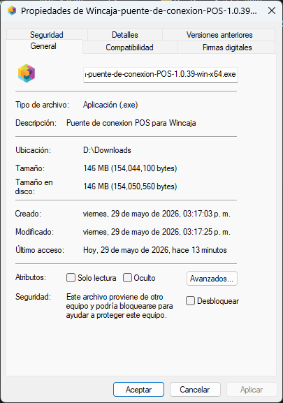
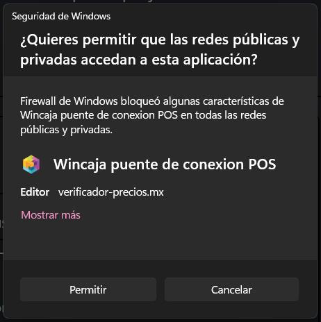
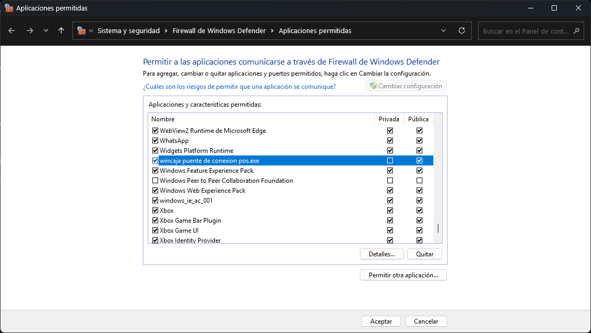
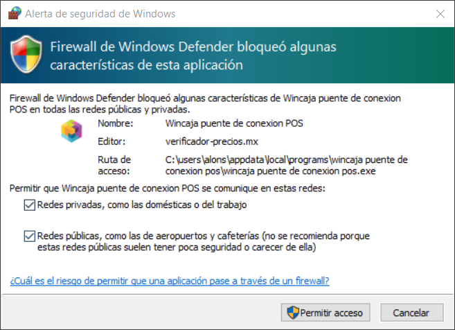
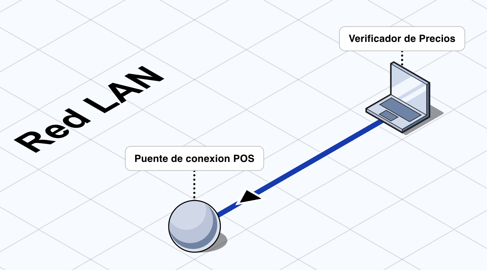
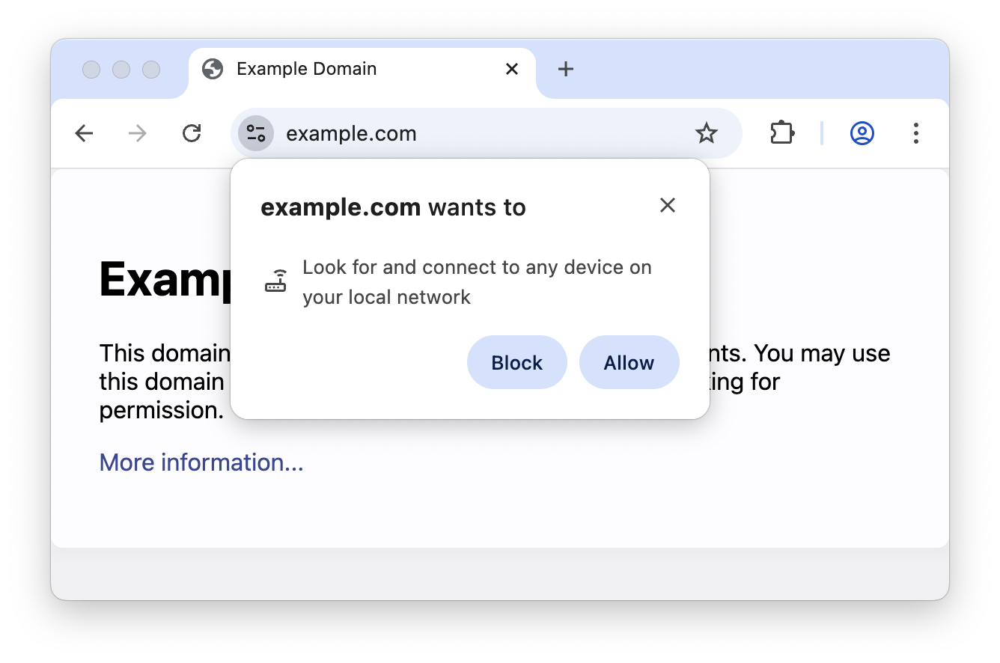

# PosCajaFacil puente de conexión POS

  

## Introducción

`PosCajaFacil puente de conexión POS` es una aplicación de escritorio que permite conectar nuestro `Verificador de Precios` con el punto de venta `PosCajaFacil`.

  

## Guía rápida de configuración

Si solo necesita una vista rápida del proceso, siga estos pasos:

1. Instale `PosCajaFacil puente de conexión POS` y permita las `conexiones entrantes` cuando `Windows` lo solicite.
2. Abra la aplicación y revise la [conexión al punto de venta](#conexión-al-punto-de-venta).
3. Confirme la carpeta de instalación de `PosCajaFacil`.
4. La aplicación obtendrá automáticamente los datos de conexión desde `C:\PosCajaFacil\PosCaja.Ini`.
5. Compruebe que la aplicación logre conectarse correctamente al punto de venta.
6. Verifique que la aplicación ya muestre la `URL para conexión del servidor`.
7. Abra el [Asistente de URL de acceso](#paso-2-abrir-el-asistente-de-url-de-acceso) o use el [QR de conexión](#emparejar-con-el-software-verificador-de-precios-usando-el-qr) para [emparejar Verificador de Precios](#emparejar-con-el-software-verificador-de-precios-usando-el-asistente).
8. [Acepte el permiso de acceso a la red local](#paso-5-permitir-el-acceso-a-la-red-local-en-el-navegador).
9. Confirme que `Verificador de Precios` complete la conexión correctamente.

Puede consultar el detalle completo en estas secciones:

- [Instalación](#instalación)
- [Conexión al punto de venta](#conexión-al-punto-de-venta)
- [Emparejar con el software Verificador de Precios usando el Asistente](#emparejar-con-el-software-verificador-de-precios-usando-el-asistente)

## Compatibilidad con sistemas operativos

La aplicación es compatible con el siguiente sistema operativo:

| Sistema operativo | Compatibilidad |
| --- | --- |
| Windows | ✅ |

### Requisitos mínimos del sistema operativo

Esta versión de la aplicación es compatible con:

| Plataforma | Recomendado |
| --- | --- |
| Windows | Windows 10 / 11 |

## Compatibilidad con punto de venta `PosCajaFacil`

- `PosCajaFacil 3.20`

## Descarga segura

Antes de instalar la aplicación, tenga en cuenta lo siguiente:

- `PosCajaFacil puente de conexión POS` es software legítimo y distribuido de forma oficial a través de [nuestro repositorio de GitHub](https://github.com/verificador-precios).
- La aplicación se construye y empaqueta siguiendo prácticas orientadas a la seguridad y a la integridad del software distribuido.
- Descargue el instalador únicamente desde el sitio oficial o desde el repositorio oficial del proyecto.
- No instale archivos descargados desde enlaces de terceros, servicios no oficiales o sitios no verificados.

## Instalación

Importante:

Para que la aplicación funcione correctamente, es necesario aceptar el permiso de `conexiones entrantes` cuando `Windows` lo solicite.

### Instalación en Windows

1. Descargue [la última versión del instalador](https://github.com/verificador-precios/puente-de-conexion-pos-poscajafacil/releases/latest).
2. Abra el archivo descargado.
3. Siga los pasos del asistente de instalación.
4. Al finalizar, abra `PosCajaFacil puente de conexión POS`.

Nota: Para instalar la aplicación en `Windows`, **no se requieren permisos de administrador**.

  

### Si Windows bloquea el instalador o la aplicación

En algunos equipos, `Windows` puede mostrar advertencias de seguridad al abrir el instalador o la aplicación. Si esto ocurre, puede usar cualquiera de los siguientes métodos.

#### Método 1: Desbloquear desde Propiedades

1. Haga clic derecho sobre el archivo descargado.
2. Seleccione `Propiedades`.
3. En la pestaña `General`, busque la sección `Seguridad`.
4. Marque la casilla `Desbloquear`.
5. Haga clic en `Aplicar`.
6. Haga clic en `Aceptar`.

  

#### Método 2: Omitir la advertencia de Windows SmartScreen

1. Haga doble clic en el instalador o en la aplicación.
2. Si aparece la pantalla `Windows protegió su PC`, haga clic en `Más información`.
3. Después, haga clic en `Ejecutar de todas formas`.

  

### Permitir conexiones entrantes en el firewall de Windows

Después de instalar y abrir la aplicación, `Windows` puede mostrar una alerta del firewall indicando que `PosCajaFacil puente de conexión POS` desea comunicarse en la red. Este permiso es necesario para que la aplicación pueda recibir conexiones locales y funcionar correctamente.

Si aparece esta ventana:

1. Verifique que la aplicación corresponda a `PosCajaFacil puente de conexión POS`.
2. Haga clic en `Permitir acceso`.
3. Si Windows muestra opciones de red, permita el acceso según la política de su entorno.

  

Si desea confirmar después que el permiso quedó aplicado correctamente:

1. Abra `Seguridad de Windows`.
2. Entre a `Firewall y protección de red`.
3. Haga clic en `Permitir una aplicación a través del firewall`.
4. Busque `PosCajaFacil puente de conexión POS` en la lista.
5. Verifique que la aplicación aparezca como permitida.

  

Si el permiso fue rechazado por error:

1. Abra `Seguridad de Windows`.
2. Entre a `Firewall y protección de red`.
3. Haga clic en `Permitir una aplicación a través del firewall`.
4. Busque `PosCajaFacil puente de conexión POS`.
5. Marque la aplicación para permitir el acceso.
6. Guarde los cambios y vuelva a abrir la aplicación.

  

## Actualización de la aplicación

  

### Actualización automática

La búsqueda de actualizaciones se ejecuta automáticamente en las versiones empaquetadas e instaladas desde los canales oficiales de publicación.

Flujo esperado:

1. Abra la aplicación.
2. Aproximadamente `15 segundos` después de abrirla, la aplicación buscará una versión nueva en segundo plano.
3. Si existe una actualización disponible, la aplicación comenzará la descarga automáticamente.
4. Cuando la descarga finalice, la aplicación mostrará un aviso indicando que la nueva versión quedó lista para instalarse.
5. Al cerrar la aplicación, se iniciará la instalación de la actualización descargada.

Si aparece el diálogo `Actualización lista`, puede usar `Actualizar ahora` para cerrar la aplicación e iniciar el proceso de actualización en ese momento.

### Plataformas activas con la actualización automática

Actualmente, la actualización automática está activa solo en `Windows`.

Si necesita actualizar manualmente, descargue e instale la versión más reciente publicada para `PosCajaFacil puente de conexión POS`.

## Primer uso

Al abrir la aplicación por primera vez, se intentará establecer la conexión con el punto de venta de manera automática usando los datos disponibles para `PosCajaFacil`.

La aplicación obtendrá de manera automática los datos predeterminados del archivo `C:\PosCajaFacil\PosCaja.Ini` para realizar la conexión con el punto de venta.

Si ese archivo no puede leerse correctamente, la aplicación usará los valores predeterminados configurados para `PosCajaFacil`.

Cuando la comunicación con el punto de venta se establezca correctamente, la aplicación mostrará una confirmación.

## Configuración de la aplicación

  

### Cómo abrir la configuración

1. Abra `PosCajaFacil puente de conexión POS`.
2. Ubique el botón `Configuración de la app`.
3. Haga clic para abrir el panel de configuración.

### Opciones disponibles

#### Comportamiento

En esta sección puede ajustar cómo responde la aplicación al iniciar y al cerrarse.

- `Lanzar aplicación al iniciar`:
  Permite que la aplicación se abra automáticamente al iniciar sesión en el sistema operativo.
- `Confirmar salida de la aplicación`:
  Muestra una confirmación antes de cerrar completamente la aplicación, para evitar detener por accidente la conexión con el punto de venta y los servicios locales.

#### Apariencia y accesibilidad

En esta sección puede adaptar la apariencia visual de la aplicación.

- `Tema visual`:
  Permite cambiar el estilo visual de la interfaz.
- `Reducir movimiento`:
  Disminuye animaciones y transiciones para una experiencia visual más estable.

#### Funciones auxiliares

En esta sección puede activar herramientas adicionales de apoyo.

- `Habilitar regeneración de QR`:
  Permite mostrar y regenerar el `QR de conexión` cuando cambie la `URL para conexión del servidor`.

### Recomendaciones de uso

- Use `Lanzar aplicación al iniciar` si necesita que el servicio esté disponible automáticamente al encender el equipo.
- Mantenga habilitada `Confirmar salida de la aplicación` para evitar cierres accidentales.
- `Reducir movimiento` puede ser útil si el equipo no tiene altas prestaciones para mostrar animaciones.
- Si comparte la conexión con otros dispositivos, conviene mantener habilitada la regeneración del `QR de conexión`.

## Conexión al punto de venta

La aplicación está preparada para conectarse al punto de venta `PosCajaFacil`.

### Cómo se obtienen los valores de conexión

La aplicación intenta obtener los datos de conexión desde el archivo `C:\PosCajaFacil\PosCaja.Ini`.

Ruta predeterminada de instalación:

- `C:\PosCajaFacil`

Archivo usado:

- `PosCaja.Ini`

Campos que la aplicación intenta leer desde `PosCaja.Ini`:

- `SERVER`: host
- `DATABASESQL`: nombre de la base de datos
- `PORT`: puerto
- `USUARIO`: usuario
- `PASS`: contraseña del POS

La aplicación cargará automáticamente esos valores en el formulario de conexión para intentar comunicarse con el punto de venta.

### Valores predeterminados usados por la aplicación

Si la aplicación no puede leer `PosCaja.Ini`, usará estos valores predeterminados:

- `Host`: `localhost`
- `Puerto`: `3306`
- `Usuario`: `root`
- `Contraseña`: `starsoftware`
- `Nombre de la base de datos`: `cajafacil`
- `Carpeta de instalación`: `C:\PosCajaFacil`

### Cómo ajustar la configuración

1. Abra `PosCajaFacil puente de conexión POS`.
2. Revise que la `Carpeta de instalación` apunte a la carpeta donde está instalado `PosCajaFacil`.
3. Si es necesario, ajuste manualmente el `Host`, `Puerto`, `Usuario`, `Contraseña` y el `Nombre de la base de datos`.
4. Compruebe la conexión.

  

### Cuándo ajustar la carpeta de instalación

Ajuste la `Carpeta de instalación` en estos casos:

- Si `PosCajaFacil` fue instalado en una ubicación distinta a `C:\PosCajaFacil`.
- Si la aplicación no logra cargar correctamente los datos desde `C:\PosCajaFacil\PosCaja.Ini`.
- Si hubo una reinstalación o migración del punto de venta a otro equipo.

### Recomendaciones

- Mantenga abierta la aplicación mientras use `Verificador de Precios`.
- Si la conexión falla, revise `Host`, `Puerto`, `Usuario`, `Contraseña`, `Nombre de la base de datos` y `Carpeta de instalación`.
- Si `PosCajaFacil` fue instalado en una ruta personalizada, actualice primero la `Carpeta de instalación` a la ruta usada.
- Si la contraseña cambió en el POS, confirme que el valor `PASS` dentro de `C:\PosCajaFacil\PosCaja.Ini` siga actualizado.

## Emparejar con el software Verificador de Precios usando el Asistente

Una vez que la aplicación esté abierta y conectada, podrá generar la liga de acceso para el `Verificador de Precios`.

  

### Paso 1: Verificar la URL para conexión del servidor

Confirme que la aplicación ya muestre la `URL para conexión del servidor`.

  

### Paso 2: Abrir el Asistente de URL de acceso

1. Dentro de la aplicación, ubique la sección de acceso.
2. Haga clic en `Asistente de URL de acceso`.
3. Se abrirá una ventana para capturar la `URL del Verificador de Precios`.

  

### Paso 3: Capturar correctamente la URL del Verificador de Precios

En el campo `URL del Verificador de Precios`, capture únicamente la dirección base del sistema web.

Ejemplo:

- `https://poscajafacil.verificador-precios-prueba.com.mx/`

### Paso 4: Guardar y usar la liga de acceso

1. Revise la `Vista previa de la URL de acceso`.
2. Si la vista previa es correcta, haga clic en `Guardar y usar`.
3. Una vez registrada la URL, se habilitarán los botones `Copiar` y `Abrir`.
4. Use `Copiar` para copiar la liga al portapapeles.
5. Use `Abrir` para abrir la liga en el navegador predeterminado.
6. Mediante la URL generada ya podrá acceder al **software Verificador de Precios emparejado a su punto de venta**.

  

### Paso 5: Permitir el acceso a la red local en el navegador

Para una mejor compatibilidad, se recomienda usar el sitio web de `Verificador de Precios` en [Google Chrome](https://www.google.com/intl/es-419/chrome/).

Si abre el sitio web de `Verificador de Precios` en `Google Chrome`, es posible que el navegador solicite permiso para acceder a la `red local`. Acepte este permiso para que el sitio web pueda comunicarse correctamente con la `URL para conexión del servidor`.

  

Referencia:
[Private Network Access update: Introducing permission prompts](https://developer.chrome.com/blog/local-network-access?hl=es-419)

## Emparejar con el software Verificador de Precios usando el QR

También puede emparejar `Verificador de Precios` usando el `QR de conexión` que genera la aplicación.

### Paso 1: Verificar que el QR esté disponible

1. Confirme que la aplicación ya muestre la `URL para conexión del servidor`.
2. Ubique la sección `QR de conexión`.
3. Espere a que la aplicación genere el código QR correspondiente.

### Paso 2: Exportar el QR

1. Dentro de la sección `QR de conexión`, haga clic en `Exportar QR`.
2. Guarde la imagen en una ubicación fácil de encontrar.

### Paso 3: Abrir la conexión rápida en Verificador de Precios

1. Abra el software `Verificador de Precios`.
2. Vaya a la sección `Conexión rápida`.
3. Elija una de las opciones disponibles para leer el QR.

  

### Paso 4: Emparejar usando el QR

Puede usar cualquiera de estas opciones:

- `Usar cámara`:
  Permite escanear el QR directamente con la cámara del dispositivo.
- `Adjuntar archivo`:
  Permite seleccionar la imagen exportada del QR desde el equipo.
- `Usar escáner 2D`:
  Permite leer el QR con un escáner compatible.

### Paso 5: Confirmar la conexión

1. Verifique que `Verificador de Precios` cargue correctamente la `URL para conexión del servidor`.
2. Revise que la URL corresponda al equipo correcto.
3. Si el QR se importó o se escaneó correctamente, la conexión se establecerá de manera automática.
4. Espere la confirmación de emparejamiento.

Si el sitio web no completa la conexión en `Google Chrome`, revise si el navegador mostró el permiso de acceso a la `red local` y acéptelo. Consulte también el [Paso 5: Permitir el acceso a la red local en el navegador](#paso-5-permitir-el-acceso-a-la-red-local-en-el-navegador).

  

### Recomendaciones

- Si no se reconoce el QR, exporte nuevamente la imagen y repita el proceso.
- Si usa `Adjuntar archivo`, asegúrese de seleccionar el QR más reciente.
- Si la conexión no se completa, confirme que la aplicación siga abierta y que la `URL para conexión del servidor` continúe disponible.

## Solución de problemas

Si la aplicación no funciona como esperaba, revise estos casos comunes:

### La aplicación no conecta al punto de venta

- Confirme que la `Carpeta de instalación` corresponda a la ubicación real de `PosCajaFacil`.
- Revise que el `Host`, el `Puerto`, el `Usuario`, la `Contraseña` y el `Nombre de la base de datos` correspondan a los valores reales del POS.
- Si depende del archivo `C:\PosCajaFacil\PosCaja.Ini`, confirme que los campos `SERVER`, `DATABASESQL`, `PORT`, `USUARIO` y `PASS` estén completos.

### No aparece la URL para conexión del servidor

- Confirme que la aplicación siga abierta.
- Revise que la conexión al punto de venta se haya completado correctamente.
- Si hubo cambios recientes en la red o en la configuración, cierre y vuelva a abrir la aplicación.
- Verifique que el firewall haya permitido las `conexiones entrantes`.

### El Verificador de Precios no se empareja

- Revise que la `URL para conexión del servidor` corresponda al equipo correcto.
- Si usa el asistente, confirme que la `URL del Verificador de Precios` esté bien escrita.
- Si usa QR, vuelva a exportar la imagen e inténtelo nuevamente.
- Confirme que la aplicación de escritorio siga abierta al momento de emparejar.

### El QR no se reconoce

- Genere nuevamente el QR desde la aplicación.
- Si usa `Adjuntar archivo`, asegúrese de seleccionar la imagen correcta.
- Si usa cámara o escáner, procure que el código QR esté nítido y completamente visible.

## Desinstalación

### Desinstalación en Windows

Para desinstalar la aplicación en `Windows`:

1. Abra `Configuración`.
2. Entre a `Aplicaciones`.
3. Busque `PosCajaFacil puente de conexión POS`.
4. Haga clic en `Desinstalar`.
5. Siga los pasos del asistente.

## Disclaimer

- PosCajaFacil y sus logotipos corresponden a sus respectivos titulares.
